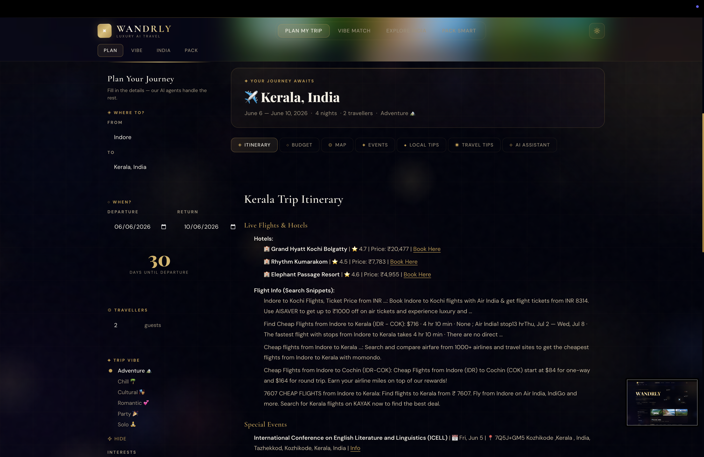
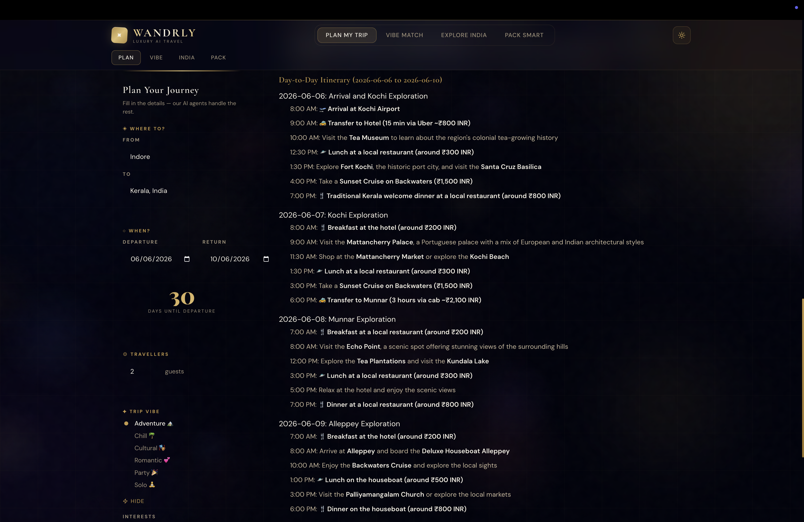
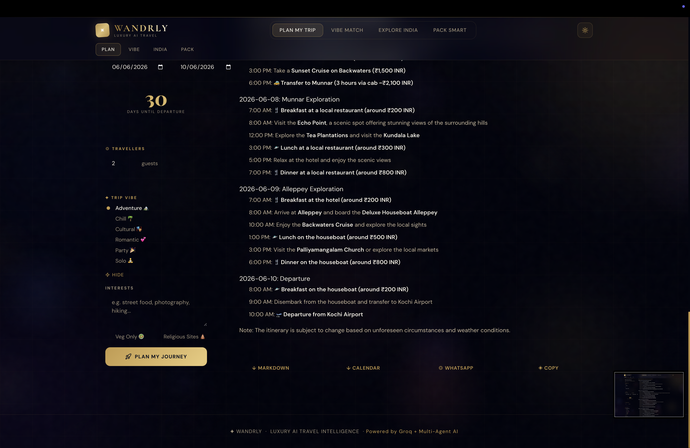
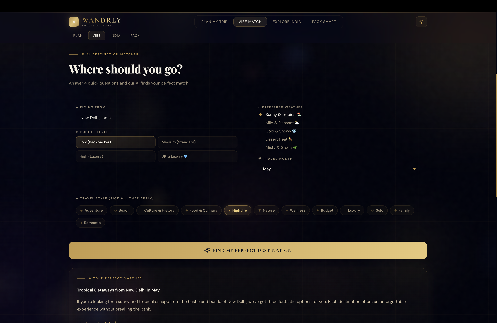
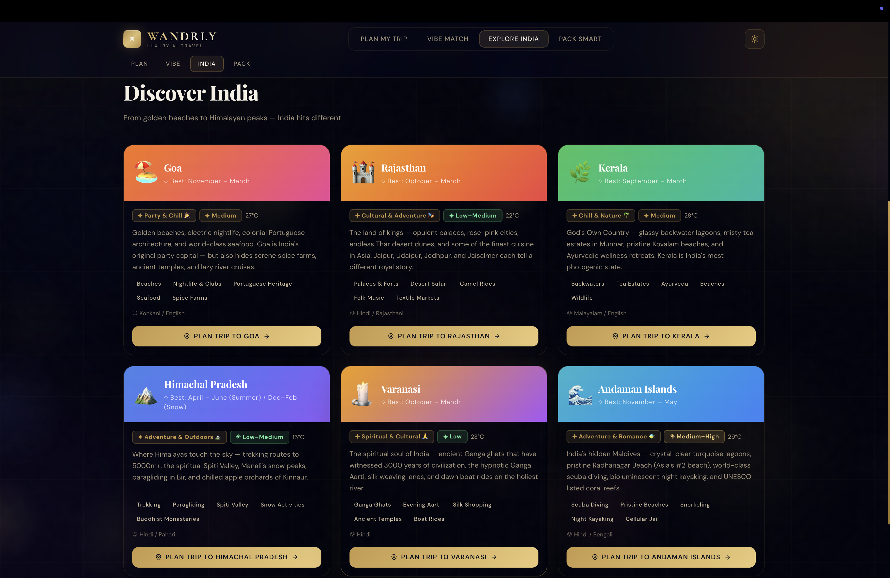
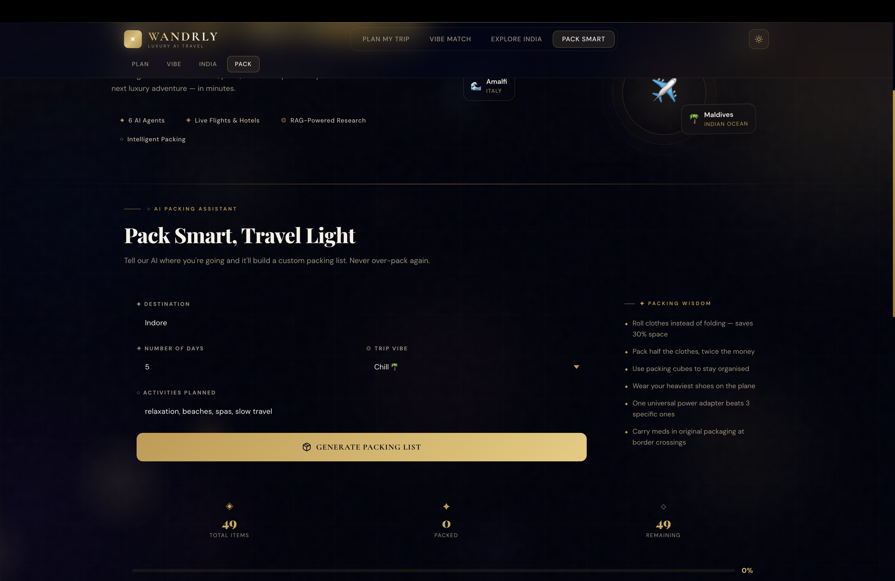

<div align="center">

# ✦ Wandrly — Luxury AI Trip Planner

**Multi-Agent AI Travel Intelligence · React 18 + FastAPI + Groq LLaMA**


*Plan it. Vibe it. Live it.*

</div>

---

## ✦ What is Wandrly?

Wandrly is a fully AI-powered luxury travel planner that orchestrates **6 specialized AI agents** to generate a complete, research-backed, day-by-day itinerary — including live hotels, flights, events, hidden gems scraped from travel blogs, smart packing lists, and a conversational trip concierge.

**v2.0** completely replaces the original Streamlit frontend with a full-stack **React 18 + FastAPI** architecture, featuring a premium gold/midnight luxury design system with animated backgrounds, Framer Motion physics, and real-time Server-Sent Events streaming.

---

## 📸 Screenshots

<table>
  <tr>
    <td align="center"></td>
    <td align="center"></td>
  </tr>
  <tr>
    <td align="center"></td>
    <td align="center"></td>
  </tr>
  <tr>
    <td align="center"></td>
    <td align="center"></td>
  </tr>
  <tr>
    <td align="center"></td>
    <td align="center"></td>
  </tr>
  <tr>
    <td align="center" colspan="2"></td>
  </tr>
</table>

---

## ✨ Features

| Feature | Description |
|---|---|
| ◈ **Multi-Agent Pipeline** | 6 AI agents: Planner → Booking → Budget → Events → RAG Research → Local Tips |
| ◎ **RAG-Powered Research** | Scrapes travel blogs, builds a FAISS vector DB, retrieves real hidden gems |
| ◇ **Live Hotel & Flight Data** | Real prices via MakCorps + SerpAPI, flight search via SerpAPI |
| ✦ **SSE Streaming** | Real-time 10-step progress stream via Server-Sent Events — no polling |
| ◆ **Vibe Match** | AI suggests destinations based on mood, budget, weather, travel style |
| ◉ **Smart Packing List** | AI-generated by category with interactive checklist + progress bar |
| ✧ **Trip Concierge Chat** | Conversational AI assistant to refine or expand your itinerary |
| ◈ **Interactive Map** | Dark Leaflet map with gold diamond marker |
| ◇ **Budget Donut Chart** | Recharts animated breakdown with per-person calculation |
| ✦ **Explore India** | Curated Indian destinations with one-click trip planning |
| ◎ **Luxury UI** | Gold/midnight theme, bokeh particles, animated blobs, dual light/dark mode |

---

## 🤖 Agent Architecture

```
User Input (React UI)
        │
        ▼  SSE stream  /api/plan-trip
┌───────────────────────────────────┐
│         FastAPI (api_server.py)   │
│   asyncio + ThreadPoolExecutor    │
└──────────────┬────────────────────┘
               │
  ┌────────────▼────────────┐
  │      Agent Pipeline     │
  │                         │
  │  1. 🌍 Image Fetcher    │  → SerpAPI images
  │  2. 🧠 Planner Agent    │  → LLM task breakdown
  │  3. 🏨 Booking Agent    │  → MakCorps hotels + SerpAPI flights
  │  4. 💰 Budget Agent     │  → LLM JSON cost estimate
  │  5. 🎉 Events Fetcher   │  → SerpAPI Google Events
  │  6. 📰 Blog RAG         │  → BeautifulSoup + FAISS + LLM
  │  7. ✍️  Summary Agent   │  → Day-by-day itinerary
  │  8. 🌏 Local Tips       │  → Language, food, safety tips
  └─────────────────────────┘
               │
  ┌────────────▼────────────┐
  │  Groq LLaMA 3.1-8B      │  ← All LLM calls (free tier)
  └─────────────────────────┘
```

---

## 🛠️ Tech Stack

### Frontend
| Layer | Technology |
|---|---|
| **Framework** | React 18 + TypeScript + Vite |
| **Animations** | Framer Motion (spring physics, layoutId, AnimatePresence) |
| **State** | Zustand |
| **Data Fetching** | TanStack React Query |
| **Charts** | Recharts (animated donut) |
| **Maps** | React-Leaflet + Leaflet (CartoDB dark tiles) |
| **Styling** | Tailwind CSS + CSS custom properties (luxury design system) |
| **Fonts** | Cormorant Garamond, Playfair Display, DM Sans |
| **Markdown** | react-markdown + remark-gfm |
| **Toasts** | react-hot-toast |

### Backend
| Layer | Technology |
|---|---|
| **API Server** | FastAPI + uvicorn |
| **Streaming** | Server-Sent Events (SSE) via `StreamingResponse` |
| **AI Inference** | Groq API (`llama-3.1-8b-instant`) |
| **Embeddings** | HuggingFace `all-MiniLM-L6-v2` (local) |
| **Vector DB** | FAISS (in-memory, per request) |
| **Orchestration** | LangChain (text splitter + document pipeline) |
| **Web Search** | SerpAPI (search, hotels, events, images) |
| **Hotels** | MakCorps API |
| **Geocoding** | Geopy |
| **Web Scraping** | BeautifulSoup4 + lxml |

---

## 🚀 Getting Started

### Prerequisites
- Python 3.10+
- Node.js 18+
- API keys (see below — all free tier)

### 1. Clone the repository

```bash
git clone https://github.com/AnishSinghYadav/wandrly-ai-trip-planner.git
cd wandrly-ai-trip-planner
```

### 2. Backend setup

```bash
python -m venv venv
source venv/bin/activate        # macOS/Linux
# venv\Scripts\activate         # Windows

pip install -r requirements.txt
```

Copy and fill in your API keys:

```bash
cp .env.example .env
```

```env
GROQ_API_KEY=your_groq_api_key
SERPAPI_KEY=your_serpapi_key
MAKCORPS_API_KEY=your_makcorps_key
```

Start the FastAPI server:

```bash
uvicorn api_server:app --reload --port 8001
```

### 3. Frontend setup

```bash
cd frontend
npm install
npm run dev
```

Open [http://localhost:5173](http://localhost:5173) in your browser.

> The Vite dev server proxies `/api/*` to `http://localhost:8001` automatically.

---

## 🔑 API Keys (All Free Tier)

| API | Free Tier | Link |
|---|---|---|
| **Groq** | 500K tokens/day | [console.groq.com](https://console.groq.com) |
| **SerpAPI** | 100 searches/month | [serpapi.com](https://serpapi.com) |
| **MakCorps** | 500 req/month | [makcorps.com](https://makcorps.com) |

---

## 📁 Project Structure

```
wandrly-ai-trip-planner/
│
├── api_server.py               # FastAPI server — SSE + 5 REST endpoints
├── agents.py                   # All 6 AI agents + data fetchers
├── app.py                      # Legacy Streamlit app (v1)
├── requirements.txt            # Python dependencies
├── .env.example                # Environment variable template
│
├── assets/
│   ├── discover_india.json     # India destinations data
│   └── state_transport.json
│
└── frontend/                   # React 18 app (v2)
    ├── index.html
    ├── vite.config.ts
    ├── tailwind.config.js
    └── src/
        ├── App.tsx             # Root layout — blobs, aurora, grid, tabs
        ├── index.css           # Luxury design system (CSS variables + utility classes)
        ├── main.tsx
        ├── types/index.ts      # TypeScript interfaces + constants
        ├── store/
        │   └── useAppStore.ts  # Zustand global state
        ├── lib/
        │   └── api.ts          # SSE client + REST fetchers
        └── components/
            ├── Navbar.tsx
            ├── HeroSection.tsx
            ├── ParticleField.tsx   # Canvas bokeh effect
            ├── BudgetChart.tsx     # Recharts donut
            ├── ChatAssistant.tsx   # Trip concierge chat
            ├── MapView.tsx         # Leaflet dark map
            └── tabs/
                ├── PlanTripTab.tsx
                ├── VibeMatchTab.tsx
                ├── ExploreIndiaTab.tsx
                └── PackSmartTab.tsx
```

---

## 🗺️ App Tabs

| Tab | What it does |
|---|---|
| ✦ **Plan My Trip** | Enter destination + dates → 6 agents stream progress → full itinerary, map, budget, chat |
| ◎ **Vibe Match** | Get AI destination suggestions by mood, budget, weather, and travel style |
| ◇ **Explore India** | Curated 6 Indian destinations with gradient cards and one-click planning |
| ◈ **Pack Smart** | AI packing list by category with checkbox tracker, progress bar, and download |

---

## ⚡ Performance

| Stage | Typical Time |
|---|---|
| Images + Planner + Booking + Budget | ~10–18s |
| Events + Blog scrape + FAISS RAG | ~10–25s |
| Research + Summary + Local Tips | ~15–30s |
| **Total pipeline** | **~35–75s** |

---

## 🎨 Design System

The luxury UI is built on CSS custom properties swapped via `data-theme`:

```css
/* Dark (default) */
--bg-void: 1 2 12;
--gold: 196 154 73;
--gold-bright: 232 200 120;
--cream: 245 240 228;

/* Fonts */
Cormorant Garamond  — headings, labels, serif elegance
Playfair Display    — hero title, large numbers
DM Sans             — body, UI text
```

Background layers (z-index 0): aurora conic glow → 5 animated gold/purple blobs → subtle grid lines → canvas bokeh particles → SVG grain overlay.

---

## 🔮 Roadmap

- [ ] Weather forecast widget
- [ ] Live currency converter
- [ ] Google Maps deep links in itinerary
- [ ] Multi-destination trip chaining
- [ ] PDF itinerary export
- [ ] Mobile PWA support

---

## 👨‍💻 Developer

**Anish Singh Yadav**
- GitHub: [@AnishSinghYadav](https://github.com/AnishSinghYadav)
- Email: anishsinghyadav2909@gmail.com

---

## 📄 License

MIT License — free to use, fork, and build on.

---

<div align="center">
✦ &nbsp; Built with React · FastAPI · Groq · Framer Motion &nbsp; ✦
</div>
